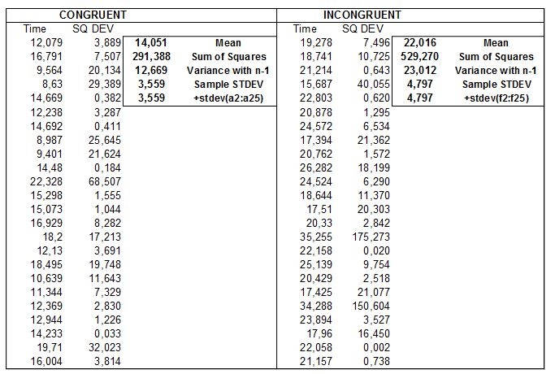

# Test a Perceptual Phenomenon
_by Eric Perbos-Brinck in fulfillment of Udacity’s Data Analyst Nanodegree, Project 1_
</br>

Use descriptive statistics and a statistical test to analyze the Stroop effect, a classic result of experimental psychology.  
Give your readers a good intuition for the data and use statistical inference to draw a conclusion based on the results.  
</br>

#### Stroop Effect (from Wikipedia)

In [psychology](https://en.wikipedia.org/wiki/Psychology), the Stroop effect is a demonstration of interference in the [reaction time](https://en.wikipedia.org/wiki/Mental_chronometry) of a task.  
When the name of a color (e.g., "blue", "green", or "red") is printed in a color not denoted by the name (e.g., the word "BLUE" printed in red ink instead of blue ink), naming the color of the word takes longer and is more prone to errors than when the color of the ink matches the name of the color.
```diff
+ GREEN
- BLUE
```
</br>

#### Q1 : Identify the variables in the experiment

The dependant variable is the time measured to name the ink colors (ie. reaction time) in equally-sized lists of identical participants.  
The independant variable is a binary variable for the color congruency.

</br>

#### Q2: Establish a hypothesis and statistical test

This test is similar to a paired difference test when subjects are measured before and after a medical treatment, the treatment here applied being « Incongruency ».  
  - The most reasonnable hypothesis : the color used to print the color's name (ie. congruent vs incongruent) will have no effect on the mean reaction time of the Congruent and Incongruent populations.  
  - The most reasonnable alternative hypothesis : the mean reaction time of the Incongruent population is superior to the Congruent population's.

Ho:  µincongruent – µcongruent  ≤ 0  
Ha:  µincongruent  – µcongruent  > 0

We assume the distributions are normal/Gaussian.  
As there is only one sample tested twice (repeated measures), the sample size is below 30 (**N=24**) and the population standard deviation is unknown (estimated from our sample data), we will use a **dependent t-test for paired samples, one-tailed in the positive direction**.  
The degree of freedom used is n-1, when n represents the number of pairs.  
</br>
  

</br>

Q3 : Report the descriptive statistics  
</br>
  
</br>


Addendum V3 : after computing the time differences Incongruent - Congruent in the spreadsheet, we obtain two key statistics.

Average of differences : 7.965
Standard Deviation of differences : 4.865

</br>

Q4 : Plot the data


Comments :

- We can see that Congruent data follows a rather standard normal distribution while the Incongruent Data is skewed to the right.

- When combining the two data sets on the same frequency scale, we can observe that the Incongruent data set as a whole is strongly positioned to the right (ie. Higher values than) of the Congruent one.


</br>

Q5 : Perform the statistical test and interpret your results

Ho:  µincongruent – µcongruent  ≤ 0
Ha:  µincongruent  – µcongruent  > 0

Ẍcongruent = 14.051
Scongruent = 3.559

Ẍincongruent = 22.016
Sincongruent = 4.797

 

Note to reviewer : See Addendum in Q3

XD = 7.965
SD  = 4.865
T-statistic = 7.965 / (4.865 / √24) = 8.021

T-critical value with DF=23 at  α = 0,05 is: 1,714

As our T-stat > T-crit in the positive direction, we can reject the null hypothesis and accept our alternative one:
Ha: µincongruent  – µcongruent  > 0

In other terms, it take significant longer time for participants to name the correct ink color when exposed to incongruent words.

The results match my expectations as I had myself more difficulty with incongruent words during my test.


</br>

Q6 : Digging deeper and extending the investigation

A. Explanations for the Stroop Effect.

According to Wikipedia (https://en.wikipedia.org/wiki/Stroop_effect#Theories), there are several theories used  to explain the Stroop Effect.
They assume that the brain is a single-processing-unit confronted with two conflicting informations, one relevant (the word's meaning) and one irrelevant (the word's color).
Most theories are based on the discrepancy of speed for the brain to read words (immediate) vs. identify colors (requires attention).

B. Variations of the Stroop Test.

In 2008, one test was designed  for illiterate individuals, named the Colored Numbers Test (CNT). If the number was black, the participants read the number. If the number was colored, the participants read the color.

Other common variations included arrows pointing upwards or downwards while positioned above or below a central point ; or using different font sizes for numbers' pairs while asking to identify the largest number (eg. 3:5 vs 5:3)
